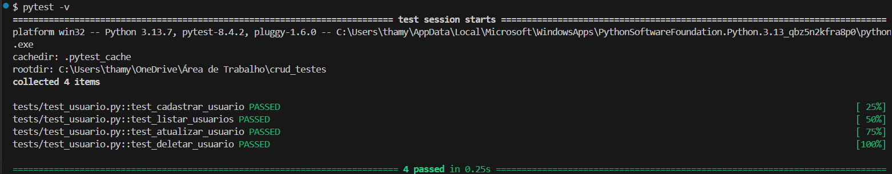

# 👥Crud de Usuários
> Projeto de exemplo de CRUD (Create, Read, Update, Delete) em Python, integrado com MySQL, com testes automatizados usando Pytest. 
Permite gerenciar dados de usuários de forma simples e prática. Feito para avaliação da disciplina e praticar conhecimentos.

## 🛠️Ferramentas utilizadas:
- Python 3.13.7
- MySQL 8.0
- Mysql-connector (depêndencia)
- Pytest (depêndencia)

## 📝Como executar o projeto:
Clonar o repositório:
```
git clone https://github.com/adeliatest/crud_python.git
```

Instalar as dependências:
> **[Obs]** Caso use outro banco de dados, você irá precisar de outras dependências específicas
```
pip install pytest mysql-connector mysql-connector-python
```

Criar o banco de dados no MySQL:
```
CREATE DATABASE nome_do_banco;
```

Atualizar o arquivo config.py:
```
# Edite usuário, senha, host e nome do banco conforme suas configurações locais
```

Executar os testes no terminal:
```
pytest ou pytest -v para um resultado mais detalhado
```

## ⚙️Funcionalidades do CRUD:
> No arquivo usuario.py você encontrará as seguintes funções:
1. Cadastrar usuário
2. Listar usuário
3. Atualizar usuário
4. Deletar usuário

## ✅Resultado dos testes:
> A imagem abaixo mostra a saída esperada ao executar os testes com sucesso:

